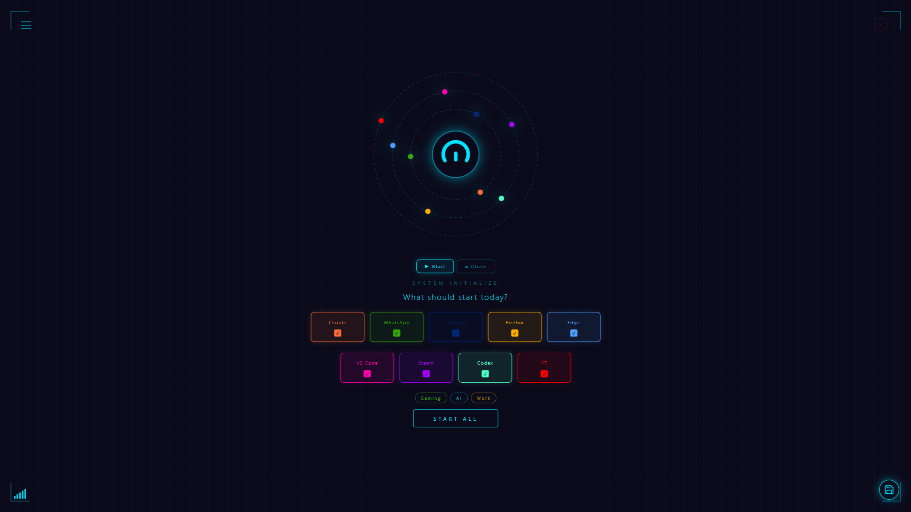
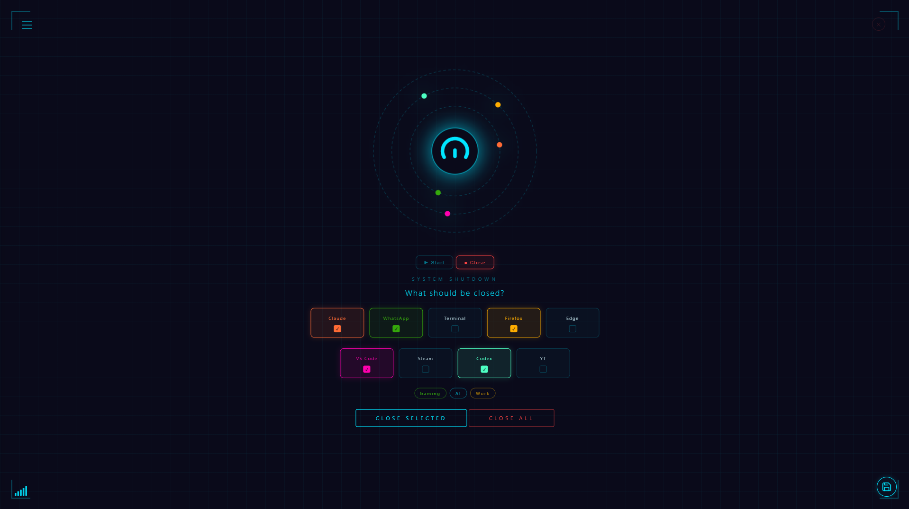
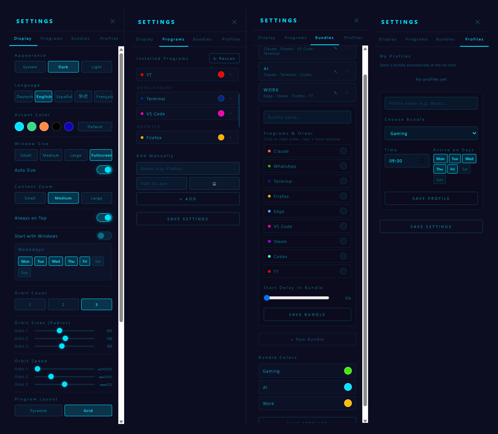

# Orbit Day Launcher

**One click. All your programs. Launched together — and closed together just as easily.**

Orbit Day Launcher is a lightweight Windows desktop app for anyone who opens (and later
closes) the same handful of programs every day: developers with their AI tool + editor +
terminal, remote workers with mail + Teams + browser, streamers with OBS + Discord + Spotify.
Instead of hunting for each program in the Start menu one by one, you pick a combination
once — and Orbit Day Launcher takes care of the rest.



---

## Download & install

**[⬇ Download the latest release](https://github.com/PhillipLeh/orbit-day-launcher/releases/latest)**
— no Rust, no Node.js, nothing else to set up. Just download, run, done.

| File | Use this when |
|---|---|
| `orbit-day-launcher_<version>_x64-setup.exe` | **Normal install — this is the one you want** |
| `Orbit-Day-Launcher-<version>.zip` | Everything in one archive: both installers, a readme (German + English), licence and screenshots |
| `orbit-day-launcher_<version>_x64_en-US.msi` | Silent or managed deployment (company rollout) |

On first launch Windows may warn about an unknown publisher, because the installer isn't
code-signed yet — see [Troubleshooting](#troubleshooting) for the two clicks that get you
past it.

**Requirements:** Windows 10 or 11 (64-bit). Microsoft Edge WebView2 is already part of
Windows 11; on older systems the installer fetches it automatically.

## Who is this for?

- You have a fixed routine ("same 5 programs every morning") and don't want to click them
  together by hand every time.
- You juggle multiple AI tools/assistants and often switch between different program
  combinations (work, learning, gaming, streaming).
- You want to **close everything at once** at the end of the day, instead of clicking
  every window shut individually.
- **You don't want your desktop to derail you.** Starting the day usually means walking
  past your game library, your chats and yesterday's tabs — and half an hour is gone.
  One click opens exactly your work set instead, so you land in focus mode straight
  away. When you're done, one more click closes it and the machine is free for the fun
  stuff again.

## Features

- **Orbit selection** — programs appear as cards that orbit around a central start button;
  the more you select, the more orbits become visible.
- **One click starts everything** — with an optional delay between programs (so, e.g., the
  VPN connects before the browser opens).
- **Web URLs open as tabs** — select several web links and they open together as tabs in
  your default browser, in one window.
- **Close mode** — the same button instead closes all selected programs as a group,
  including Microsoft Store/UWP apps, which are normally tricky to close programmatically.
- **Bundles** — save fixed program combinations ("Work", "Gaming", "Stream") and switch
  between them with one click.
- **Time-based profiles** — automatically suggest a bundle at set times/weekdays (with a
  countdown you can cancel).
- **Automatic program detection** — finds installed Store/UWP apps, categorizes them
  (AI, Browser, Development, Communication, …) and filters out Windows system clutter.
  Runs in the setup wizard on every start (can be switched off) and any time you ask for
  it via **Rescan** — see
  [First run & finding your programs](#first-run--finding-your-programs).
- **Multi-language UI** — German, English, Spanish, Hindi, and French, switchable anytime.
- **Fully customizable** — Light/Dark/System theme, custom accent color, layout
  (pyramid/grid), window size, and your own keyboard shortcut to show/hide the window
  (default `Ctrl + Alt + O`).
- **Start with Windows** (optional, with weekday selection).
- **System tray menu** — right-click the tray icon to start or close any bundle (or
  everything at once) without opening the window. Left-click shows/hides the launcher.
- **Delete protection** — the ✕ on a program card only works while you hold a chosen key
  (Ctrl by default), so a fast click can't remove a program by accident. While the key is
  held, the delete buttons turn red and wiggle.

## First run & finding your programs

When you start Orbit Day Launcher, a setup wizard opens and scans your PC for installed
programs. Found apps are grouped by category — tick the ones you want and click
**Let's go**, or skip the step and add programs later.

By default this wizard runs on **every** start, so newly installed software always gets
picked up. If you'd rather go straight to the launcher, turn it off:

| What you want | Where |
|---|---|
| Skip the wizard from now on | **Settings → Programs → "Show setup wizard on every start"** → off |
| Search once, on demand | **Settings → Programs → ↻ Rescan** — opens the same picker with everything newly found |

With the toggle off, the wizard only ever appears on the very first start after
installation. You can switch it back on at any time.

Programs that aren't detected automatically can be added by hand under
**Settings → Programs → Add manually** — either a path to an `.exe`/shortcut, or a web
address, which then opens as a browser tab.

## Screenshots

### Start & close modes

<table>
<tr>
<td width="58%"></td>
<td><b>Start mode</b><br>Pick the programs (or a saved bundle) and launch them all with a single click. The orbit reflects your current selection; each program keeps its own colour.</td>
</tr>
<tr>
<td width="58%"></td>
<td><b>Close mode</b><br>The same button switches to closing the selected programs as a group — including Store/UWP apps that are otherwise awkward to shut down.</td>
</tr>
</table>

### Settings

All four settings tabs — Display, Programs, Bundles, and Profiles:



## Tech stack

Built with [Tauri 2](https://tauri.app/) (Rust backend, ~2–3 MB instead of the
100+ MB typical of Electron apps) and plain HTML/CSS/JavaScript on the frontend —
no build step, no framework.

## Build from source

> **You don't need this to use the app** — grab the installer under
> [Download & install](#download--install). Build from source only if you want to change
> something or verify the binary yourself.

**Requirements:** [Rust](https://www.rust-lang.org/tools/install) and
[Node.js](https://nodejs.org/).

```bash
git clone https://github.com/PhillipLeh/orbit-day-launcher.git
cd orbit-day-launcher
npm install

# Run in development
npm run tauri dev

# Build a standalone app + installer (output under src-tauri/target/release)
npm run tauri build
```

## The tray menu

Orbit Day Launcher keeps running in the system tray (bottom-right of the taskbar, you may
need to expand the hidden icons). From there you can drive it without opening the window:

| | |
|---|---|
| **Left-click** | show / hide the launcher window |
| **Right-click → Start ▸** | *Start everything*, or one of your bundles |
| **Right-click → Close ▸** | *Close everything*, or one of your bundles |
| **Right-click → Open / Quit** | show the window, or exit the app |

The bundle entries mirror whatever bundles you have saved — create or delete one and the
menu updates itself. Labels follow the language you picked in the settings.

## Delete protection

Program cards in the launcher have a small ✕ to remove them. To stop a fast click from
deleting the wrong program, that ✕ only reacts while you **hold a key** — `Ctrl` by
default. Hold it and every delete button turns red and wiggles, so you can see that
deleting is now armed.

Change the key (or switch the protection off) under **Settings → Profiles → Delete
protection**: `Ctrl`, `Shift`, `Alt` or `Off`.

## Your settings

Everything you configure — programs, bundles, profiles, colours, theme, language,
shortcut — is stored in a single file on your own machine:

```
%APPDATA%\com.luxosofficial.orbit-day-launcher\settings.json
```

Nothing is uploaded anywhere; the app works fully offline. Copy that file to back your
setup up or move it to another PC. Deleting it resets the app to a clean state (the
setup wizard will greet you again on the next start).

> The file is written atomically (write to a temp file, verify, then replace), so a
> crash or power loss mid-save cannot leave you with a corrupted configuration.

## Security

Orbit Day Launcher exists to start other programs, so it takes care that *only* what you
configured can be started:

- **No command interpreter is involved.** Programs are launched through the Windows shell
  (`explorer.exe` / ShellExecute) rather than `cmd.exe`. A path from the configuration is
  passed as a single value, so characters like `&`, `|` or `^` stay part of the path
  instead of turning into commands.
- **Values from the configuration are validated** before they reach the system — package
  and process names are restricted to a narrow character set, so a wildcard can't widen a
  "close this app" into "close everything matching this".
- **Program names are escaped before display.** Names you type are inserted as text, never
  as markup, so a name like `<b>test</b>` shows up literally.
- **Only the days you picked** are written into the autostart entry.
- **Least privilege:** the app requests only the Tauri core and opener permissions — no
  filesystem or shell plugin.
- **No telemetry, no accounts, no cloud.** The only network access is a short connectivity
  check against a public DNS resolver for the online indicator, plus whatever the programs
  and web links *you* configured do themselves.

**Trust boundary:** `settings.json` is treated as *your* data on *your* machine. Don't
import a configuration file from someone you don't trust — it lists programs to launch,
and launching programs is exactly what this app does.

Found a security issue? Please open an issue (or contact the author directly for anything
sensitive).

## Troubleshooting

**"Windows protected your PC" when installing.**
The installer isn't code-signed yet, so Windows SmartScreen shows a warning for unknown
publishers. Click **More info → Run anyway**. Code signing is planned.

**A program won't close in close mode.**
Store/UWP apps are closed via their install path rather than their process name, because
the two often differ. If a specific app resists, please open an issue with its name.

**A program wasn't found by the scan.**
Classic `.exe` programs without a Start-menu entry aren't always detected. Add them by
hand under **Settings → Programs → Add manually**.

## Status

Functional and in daily use by the author; released as v0.1. Windows only.
The installer isn't code-signed yet (see [Troubleshooting](#troubleshooting)).
Feedback and issues are very welcome.

## License

[MIT](LICENSE) © 2026 Phillip Lehmann
